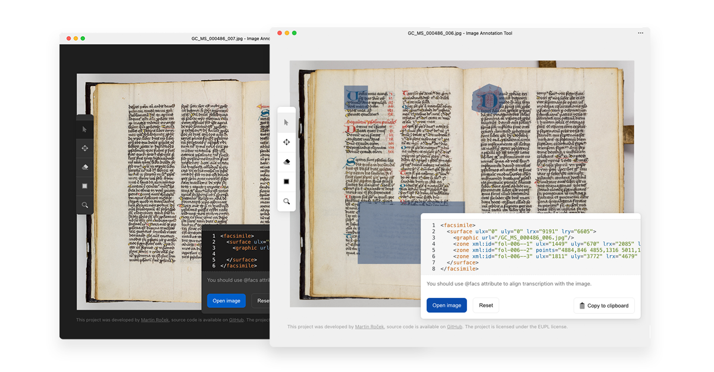

# Image Annotation Tool



Image annotation tool is a web application that allows users to mark zones of interest in an image. These zones are then converted to TEI P5 code snippet that can be used in your document to connect the image and the text. This tool was developed to help students and teachers at the [Faculty of Arts, Charles University](https://ff.cuni.cz/) to mark and annotate images of manuscripts.


## Usage
Visit [the app website](http://ima.coders.tools/), open your image and start annotating.
The app can be installed as PWA (Progressive Web App).

## Development
All contributions are welcomed. The web app is written in [React.js](https://facebook.github.io/react/) and uses [React Draggable](https://www.npmjs.com/package/react-draggable) for dragging tool panes.

### Installation
```
git clone git@github.com:silencesys/dh--image-annotation-tool.git
npm install
npm start
```

## Used components and libraries
- [React](https://reactjs.org/)
- [OpenSeadragon](https://openseadragon.github.io/)
- [React Draggable](https://www.npmjs.com/package/react-draggable)
- [Font Awesome](https://fontawesome.com/)
