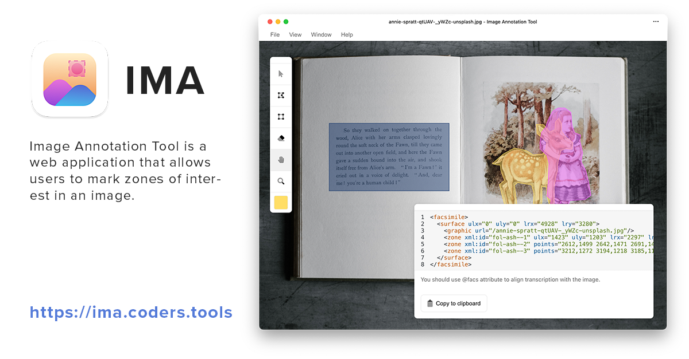

# Image annotation tool



Image annotation tool is a web application that allows users to map znoes of interest in an image. These zones are then converted to pre-made code snippet that can be used in a TEI P5 document to
connect the image to the text. This tool was developed to help student and teachers in the [Faculty of Arts, Charles University](https://ff.cuni.cz/) to annotate images of manuscripts.


## Usage
Visit [the app website](http://ima.coders.tools/), open your image and start annotating.
The app can be installed as PWA (Progressive Web App).

## Development
All contributions are welcomed. The app is written in [React.js](https://facebook.github.io/react/) and uses [React Draggable](https://www.npmjs.com/package/react-draggable) for dragging tool panes.

### Installation
```
git clone git@github.com:silencesys/dh--image-annotation-tool.git
npm install
npm start
```
